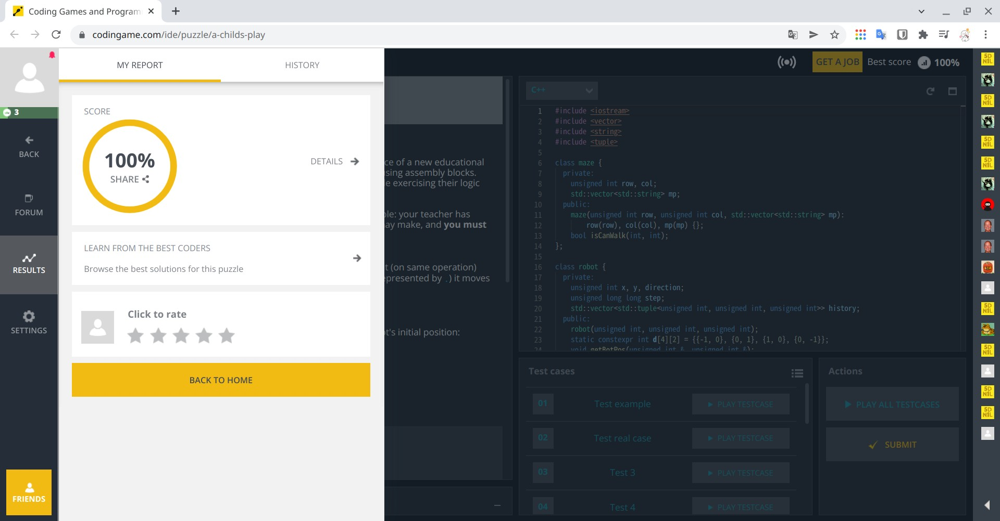

# HW1 - A Child's Play
## Task
- Solve the problem "[A Child's Play](https://www.codingame.com/ide/puzzle/a-childs-play)" on the CodinGame platform.
## Requirements
- Solve the problem with a 100% score.
- Design and implement at least two classes: Maze and Robot. (You can add more classes if needed.)
- Make your classes and objects easy to use.
- Write your program in a good coding style.
- Save the source codes as hw1.cbp / main.cpp / robot.h / robot.cpp / maze.h / maze.cpp ( / ...).
---
