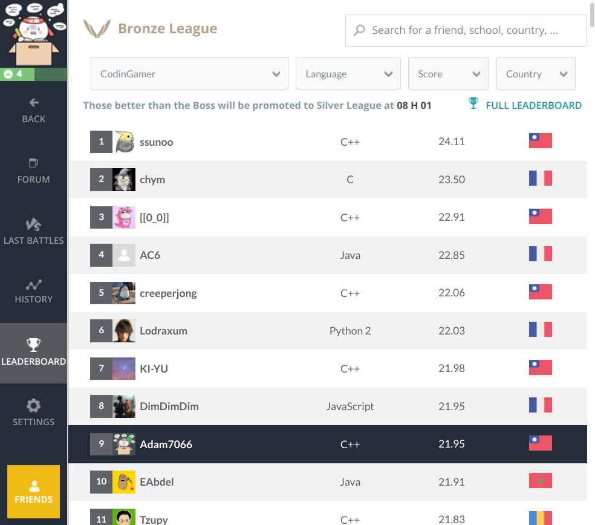

# HW2 - Code a la Mode
- CodinGame: [Code a la Mode](https://www.codingame.com/ide/puzzle/code-a-la-mode)

## 合併小工具 簡介
- 使用 `make` 合併出 `merge.cpp`
- 所有程式碼放在 `code` 資料夾下
- `xxx.h`
    - 開頭結尾命名方式為:
        ```cpp
        #ifndef xxx_H
        #define xxx_H
        ...
        #endif
        ```
    - 只能有一個 class 並且命名為 `xxx`
---
## 精彩時刻
